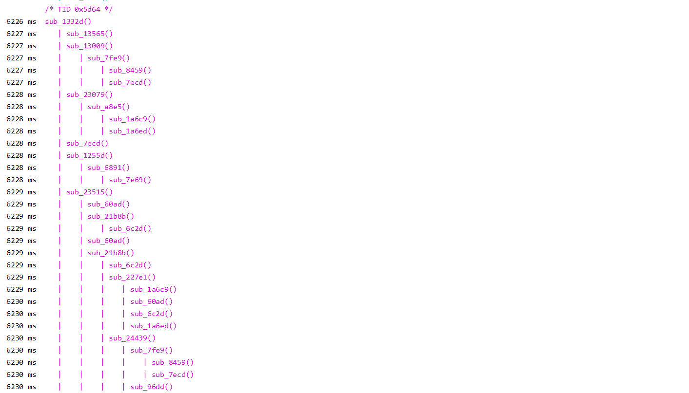

# trace_natives

一个IDA小脚本，获取SO代码段中所有函数的偏移地址，再使用frida-trace 批量trace so函数的调用。

## 使用方法

1.将traceNatives.py丢进IDA plugins目录中

* 在ida 的python console中运行如下命令即可找到plugins目录：print（os.path.join(idaapi.get_user_idadir(), "plugins")）
* traceNatives可能会有报错，版本兼容问题，可查看ida控制台去修改

2.IDA中打开对应的so文件，Edit-Plugins-traceNatives

IDA输出窗口就会显示如下字眼：

**使用方法如下：**

在想要查看的app下处于前台下，运行此即可打印出具体的调用信息，后面为地址，会生成一系列的js文件

frida-trace -UF -O C:\Users\Lenovo\Desktop\2021\mt\libmtguard.txt**



## 代码出发点

和朋友在分析android so的时候，他感慨了一句，“唉，要是能捋清整个流程就好了”。确实，搞清楚流向的件挺重要的事，只要代码复杂一些，函数多一些，分支多一些，通过函数指针跳转多一些……不管哪一个多一些，静态分析SO就会变得十分恼人。

得益于Frida布道师[@r0ysue](https://github.com/r0ysue)以及看雪Android逆向课程的大力推广，近来入门Android逆向的技术人员，个个都用上了Frida以及其工具套件，生产力大大提高。Java层的Objection+Frida一梭子，已经非常快乐的替代了Xposed的位置，而且效率翻了很多倍。而在Native层，情况不太一样，[JNItrace](https://github.com/chame1eon/jnitrace)是一个非常棒的工具，让JNI操作一览无余。Frida Hook也依然优雅，几行代码就可以根据偏移地址Hook打印输出，但native代码稍微有些复杂的时候，还是觉得有些力不从心，但能不动态调试还是不想用IDA动态调试，因为觉得动态调试比Frida麻烦多了。

所以我就想能不能用frida做一个SO函数的批量Hook或者叫trace，减少一部分使用IDA动态调试的需求。结果发现frida-trace 就可以很好的做这件事，非常nice。


## 编写过程

想法很简单

* 使用idapython编写脚本得到代码段中所有函数的偏移地址
* 编写Frida脚本批量Hook

步骤二遇到了问题，批量Hook几百个函数，APP很容易崩溃，除此之外，打印效果也不算很好。

所以开始想办法优化，一是只打印汇编指令长度大于10条的函数，trace嘛，抓住主线就行了，如果在你的测试环境下还会崩溃，可以修改代码，进一步减少hook的函数数量。
而打印效果不好的问题，我偷了个懒，利用一波官方工具。

Frida-trace是Frida官方的trace工具，它一直在更新发展，越来越强大，但大家对它的关注度一直不太高，其实可以好好挖一下der。

下面例举几种用处

批量HOOK Java方法，支持正则表达式模糊匹配。

```powershell
frida-trace -UF -j '*!*certificate*/isu'
```

Hook 所有静态注册的JNI函数

```
frida-trace -UF -i "Java_*"
```

Hook 未导出函数

```powershell
frida-trace -UF -a "libjpeg.so!0x4793c"
```

我就是利用的最后一种，同时白嫖它的trace和排版。

```powershell
frida-trace -UF -a "libjpeg.so!0x4793c" -a "libjpeg.so!0x227c" -a "libjpeg.so!0x9193" -a xxx
```

但是这样做的话，命令实在是太长了，windows上甚至会超过限定的命令行长度，还好Frida-trace提供了-O path 的方式传入一个脚本。除此之外，Frida-trace显示函数地址的方式是“sub_Hook地址”，因为Thumb模式下要+1的缘故，所以Frida trace中“sub_123C”在IDA中显示是“sub_123B”，对照ida分析时要注意一下。

y1s1，虽然实际代码只有了几十行，但效果还真挺好的，希望可以减轻大佬们在逆向分析过程中的工作量。
